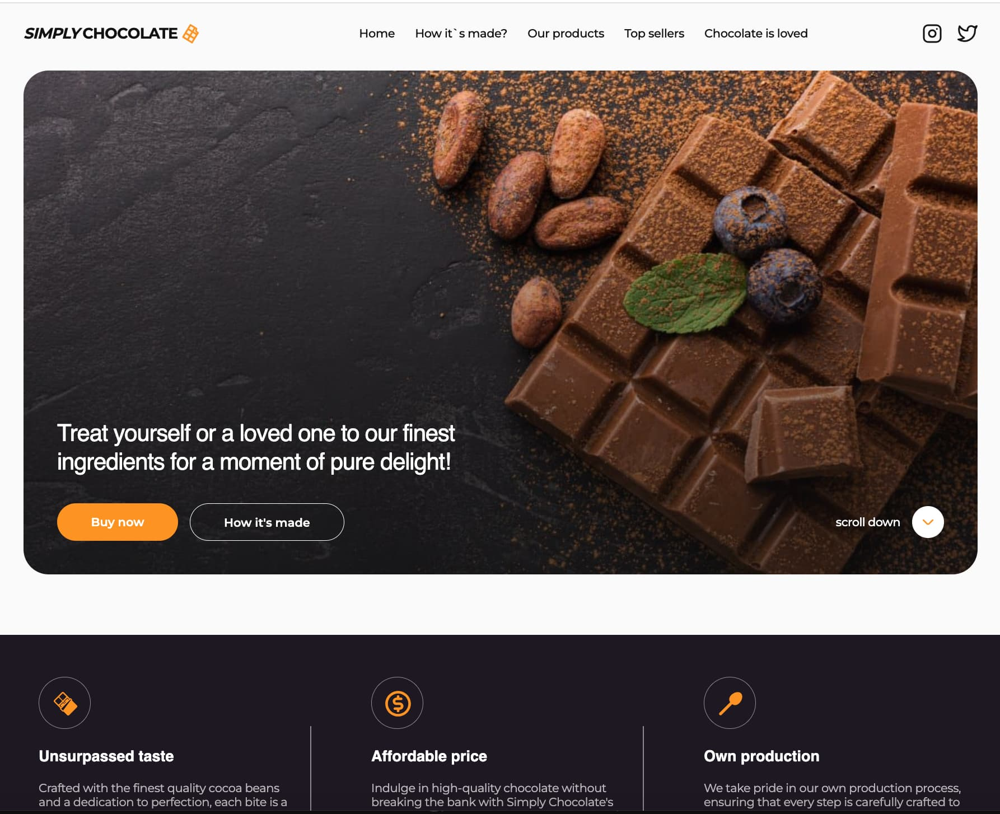
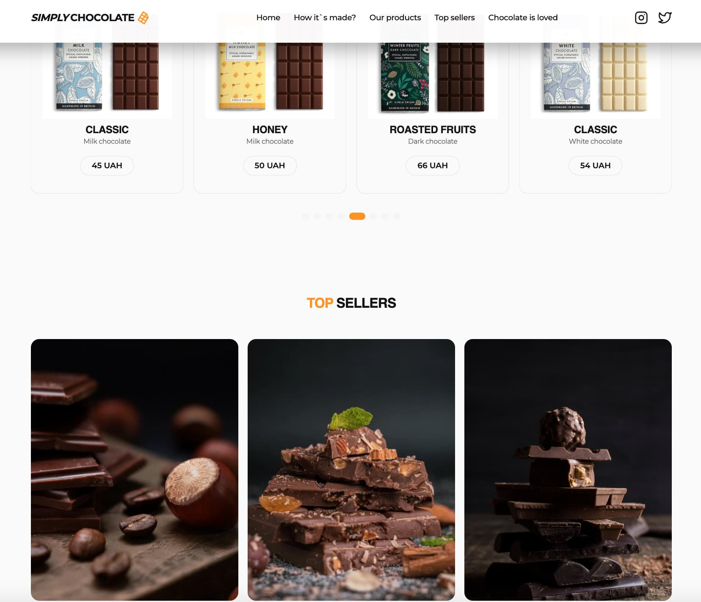

# Simply Chocolate

Welcome to Simply Chocolate, the app for a company that offers and sells
delicious chocolates.

## Table of Contents

- [Overview](#overview)
- [Features](#features)
- [Technologies Used](#technologies-used)
- [Screenshots](#screenshots)
- [License](#license)
- [Contact](#connect-with-me)

## Overview

Simply Chocolate is an app designed for a chocolate company, providing a
delightful user experience for exploring and purchasing chocolates. The app
includes a sticky header, a hero section with a "Buy Now" button and information
on how the chocolates are made. Additionally, users can choose products through
a modal window, enter personal data, and proceed to purchase.

## Features

- Sticky header for easy navigation
- Hero section with a "Buy Now" CTA button
- Modal window for product selection and purchase
- Overview of products
- Company benefits
- "Why Choose Us" section
- Animated cards showcasing chocolate ingredients
- Video of the chocolate-making process
- Products list using Swiper
- Top seller section with a "Buy Now" CTA button
- Customer reviews
- Footer with contact information

## Technologies Used

- 
- 
- 
- 

## Screenshots

 _Caption for Screenshot 1
(simply-chocolate Home Page)_ 
_Caption for Screenshot 2 (simply-chocolate Home Page)_

## Issues

If you encounter any issues or have suggestions, please
[open an issue](https://github.com/Alexandrbig1/simply-chocolate/issues).

## License

This project is licensed under the [MIT License](LICENSE).

## Feedback

I welcome feedback and suggestions from users to improve the application's
functionality and user experience.

### Languages and Tools:

  
 

### Connect with me:

  

  

